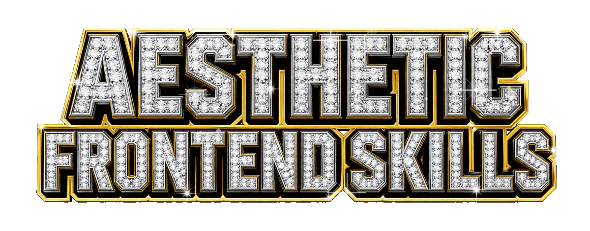
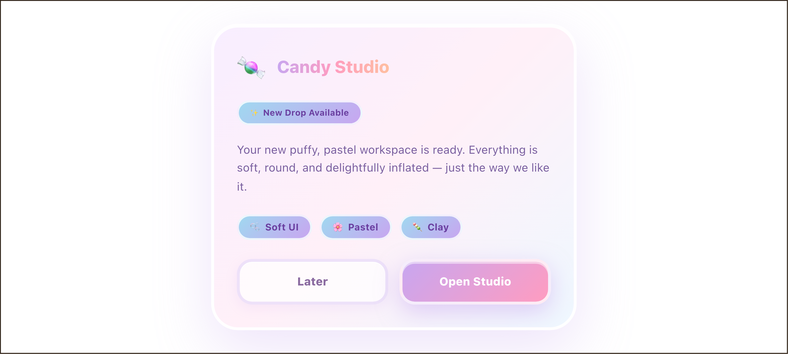
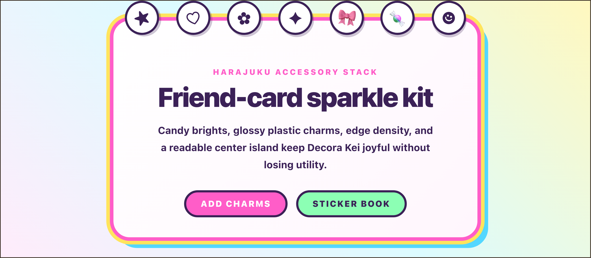
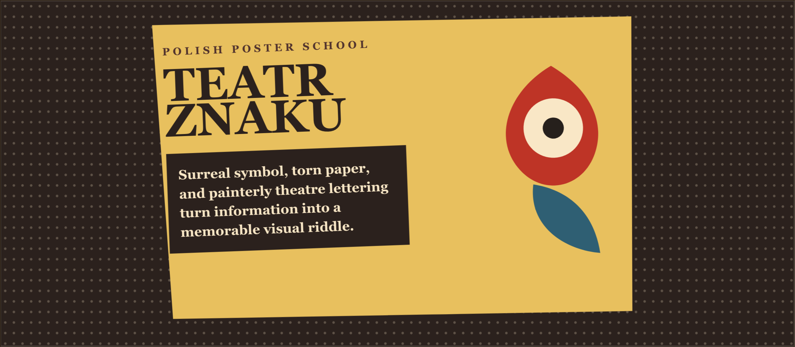
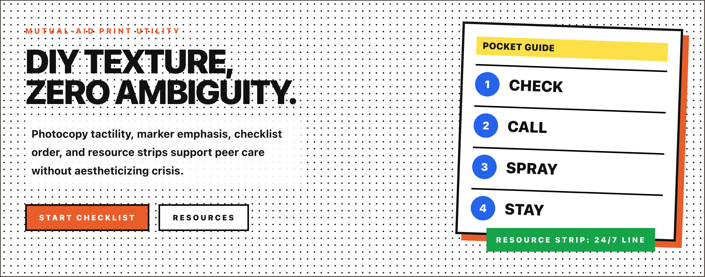
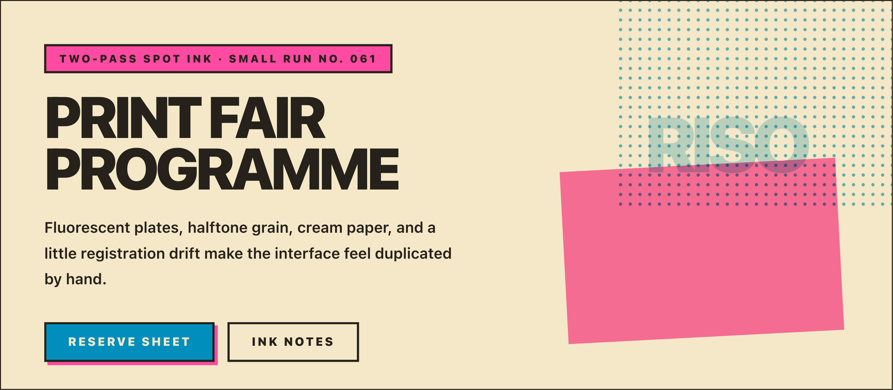
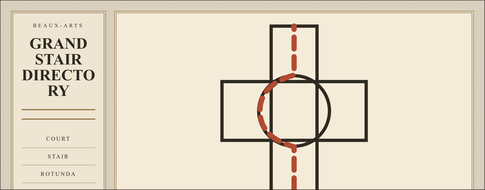
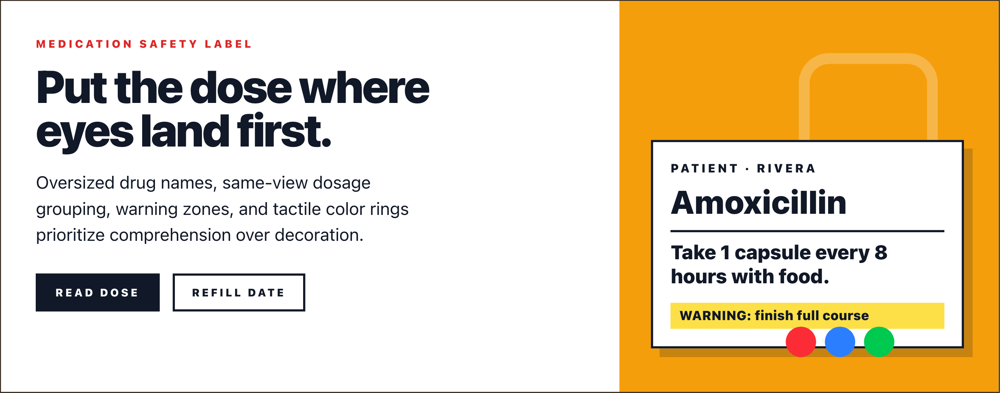
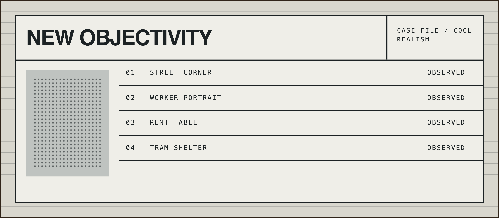
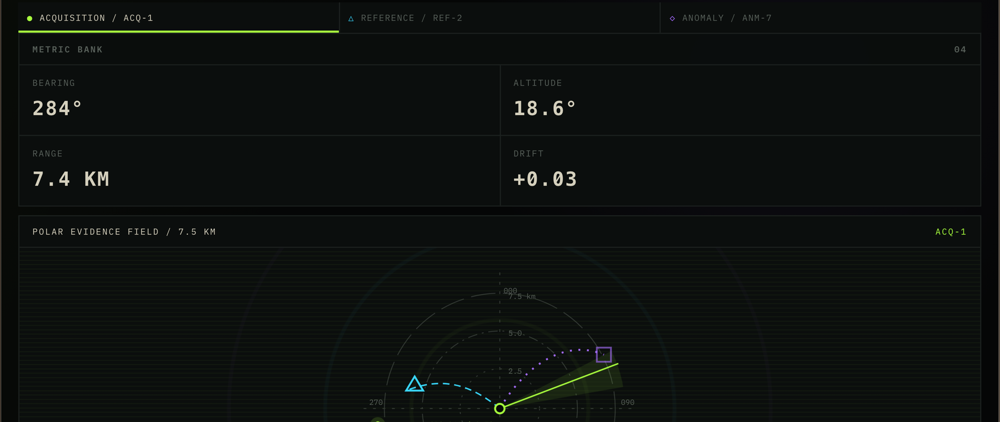

<p align="center">
  <a href="https://aesthetic-design.art">
    
  </a>
</p>

<p align="center">
  turn named aesthetics into frontend design direction, CSS custom properties, design tokens, and implementation guidance for AI agents.
</p>

<p align="center">
  <a href="https://aesthetic-design.art"></a>
  <a href="https://skills.sh/alexiseverage/aesthetic-frontend-skills"></a>
  <a href="LICENSE"></a>
</p>

<p align="center">
  <a href="#quick-install">Quick install</a>
  ·
  <a href="#which-skill-should-i-use">Choose a skill</a>
  ·
  <a href="#aesthetic-examples">Aesthetic examples</a>
  ·
  <a href="https://aesthetic-design.art">Live showcase</a>
</p>

## What it is

A focused two-skill package for AI agents that need a grounded, repeatable way to move from cultural style language to developer-ready UI decisions. Use it when a product brief says "make this feel like Y2K," "apply dark academia," or "give me usable tokens for a vaporwave interface."

The public package intentionally exposes only two skills:

| Skill | Use it for | Produces |
| --- | --- | --- |
| [`aesthetic-literacy`](skills/aesthetic-literacy/SKILL.md) | Identifying, disambiguating, and characterizing aesthetics | Canonical slugs, 7-dimension profiles, connotation notes, and anti-patterns |
| [`aesthetic-application`](skills/aesthetic-application/SKILL.md) | Translating a confirmed aesthetic into frontend guidance | Tokens, CSS variables, cultural markers, component notes, and implementation flags |

Scope boundary: this package covers aesthetics. It can flag accessibility, dark-mode, and reduced-motion conflicts, but it does not replace your product accessibility, layout, component architecture, or performance standards.

## Aesthetic examples

The website shows how the vocabulary becomes concrete interface direction across very different visual systems.

This package includes 127 aesthetics. These are a small sample; browse the full live showcase at [aesthetic-design.art/showcase](https://aesthetic-design.art/showcase).

These examples are generated components from the package's aesthetic vocabulary. They are illustrative, not a deployment guarantee.

<div align="center">

<table align="center">
<tr>
  <td align="center" width="50%"><a href="screenshots/claymorphism.png"></a><br/><sub>Claymorphism</sub></td>
  <td align="center" width="50%"><a href="screenshots/decora-kei.png"></a><br/><sub>Decora Kei</sub></td>
</tr>
<tr>
  <td align="center" width="50%"><a href="screenshots/polish-poster-school.png"></a><br/><sub>Polish Poster School</sub></td>
  <td align="center" width="50%"><a href="screenshots/harm-reduction-zine.png"></a><br/><sub>Harm Reduction Zine</sub></td>
</tr>
<tr>
  <td align="center" width="50%"><a href="screenshots/risograph.png"></a><br/><sub>Risograph</sub></td>
  <td align="center" width="50%"><a href="screenshots/beaux-arts.png"></a><br/><sub>Beaux-Arts</sub></td>
</tr>
<tr>
  <td align="center" width="50%"><a href="screenshots/prescription-label-clarity.png"></a><br/><sub>Prescription Label Clarity</sub></td>
  <td align="center" width="50%"><a href="screenshots/new-objectivity.png"></a><br/><sub>New Objectivity</sub></td>
</tr>
<tr>
  <td align="center" colspan="2"><a href="screenshots/xlyk.png"></a><br/><sub>XLYK</sub></td>
</tr>
</table>

</div>

## Outcomes

Agents using these skills should be able to:

1. Resolve a named or loosely described aesthetic to a canonical slug.
2. Describe the aesthetic across palette, type, texture, shape, motion, spatial conventions, and cultural markers.
3. Identify non-negotiable visual signals and anti-patterns that would make the result feel generic.
4. Produce developer-ready design tokens, CSS custom properties, component notes, and implementation guidance.
5. Keep routine app-design work on compact skill-local references instead of loading large research/provenance files.

## Which skill should I use?

| Need | Use | Output |
| --- | --- | --- |
| "What aesthetic is this?" or "compare these aesthetics" | [`aesthetic-literacy`](skills/aesthetic-literacy/SKILL.md) | A 7-dimension characterization, disambiguation, connotation notes, and canonical slug lookup. |
| "Make this product look like X" | Start with [`aesthetic-literacy`](skills/aesthetic-literacy/SKILL.md), then [`aesthetic-application`](skills/aesthetic-application/SKILL.md) | Confirmed aesthetic direction followed by tokens, CSS variable guidance, cultural markers, component notes, and flags. |
| "Give me CSS variables/design tokens for X" | [`aesthetic-application`](skills/aesthetic-application/SKILL.md) after the aesthetic is confirmed | Implementable token values, CSS translation patterns, component-level notes, and unresolved-risk flags. |
| "Maintain or audit the aesthetic data" | Repository scripts and `knowledge/aesthetics/` | Validation, provenance review, generated index refresh, and dictionary updates. |

## Example prompts

```text
Use aesthetic-literacy to compare vaporwave and synthwave for a fintech dashboard. Name the better fit and explain the tradeoffs.
```

```text
Use aesthetic-application to apply dark academia in nostalgic quotation mode to a documentation site. Produce design tokens, CSS custom properties, component notes, and WCAG flags.
```

```text
The client asked for "cozy retro but not kitsch." Use aesthetic-literacy to disambiguate the likely aesthetics and ask one targeted question before producing a spec.
```

```text
Apply Web 2.0 Gloss to a pricing page. Keep the output developer-ready: token table, CSS variables, cultural markers, components, and implementation flags.
```

## Quick install

Install both public skills from skills.sh:

```bash
npx skills add alexiseverage/aesthetic-frontend-skills
```

Install them globally for agents that support user-scope skills:

```bash
npx skills add alexiseverage/aesthetic-frontend-skills -g
```

Install one skill at a time:

```bash
npx skills add alexiseverage/aesthetic-frontend-skills@aesthetic-literacy
npx skills add alexiseverage/aesthetic-frontend-skills@aesthetic-application
```

For local development or pre-release validation from a clone, run discovery against the repository root:

```bash
npx skills add . -l --full-depth
```

If your environment already provides the `skills` binary, the equivalent local command is:

```bash
skills add . -l --full-depth
```

## Installed package layout

Installed users primarily need the skill-local files:

- `skills/aesthetic-literacy/SKILL.md` — trigger rules, 7-dimension framework, disambiguation protocol, and dictionary lookup workflow.
- `skills/aesthetic-literacy/references/aesthetic-index.md` — generated slug, family, redirect, and alias index.
- `skills/aesthetic-literacy/aesthetics/<slug>.md` — compact canonical production guidance for each supported aesthetic.
- `skills/aesthetic-application/SKILL.md` — application workflow and output requirements.
- `skills/aesthetic-application/references/` — output contract, token template, CSS translation patterns, and component-note contract.

Root `knowledge/aesthetics/` files are maintainer/provenance resources. They are useful for source review and data maintenance, but they are not the normal hot path for token generation or product design handoffs.

## Data model

Each canonical aesthetic entry is designed to be small enough for routine agent use while still carrying enough structure to prevent vague mood-board output.

- Frontmatter identifies `slug`, `label`, `family`, `era`, `aliases`, `status`, `evidence_level`, related aesthetics, and subsets.
- The body covers the 7-dimension profile: palette, type, texture, shape, motion, spatial conventions, and cultural markers.
- Entries include non-negotiables, connotation guidance, related/subset notes, frontend/UI guidance, CSS translation notes, typography/font guidance, cultural/ethical notes, and anti-patterns.
- Redirect entries point older or superseded terms to the canonical slug.
- `scripts/generate_aesthetic_index.py` renders the installed-user index from dictionary frontmatter, and `python3 scripts/generate_aesthetic_index.py --check` verifies that index freshness.

See [`skills/aesthetic-literacy/references/artifact-schema.md`](skills/aesthetic-literacy/references/artifact-schema.md) for the compact installed-user schema reference.

## Validation commands

Contributor validation requires **Python 3.10 or newer**. The default `make check` target runs a version preflight and exits with an actionable error before invoking the Python validators or test suite when the interpreter is unsupported. Node.js and `npx` are also required for the final skills-discovery check.

Run these before opening a release or content PR:

```bash
python3 -m pip install -r requirements.txt
make check
python3 scripts/generate_aesthetic_index.py --check
npx skills add . -l --full-depth
```

`make check` runs:

- `make doctor` for repository structure and executable-script checks.
- `make validate` for strict profile and dictionary validation, plus skill metadata, trigger fixtures, generated index, and link validation.
- `make audit` for strict dictionary/profile consistency and target-schema auditing.
- `make test` for the pytest regression suite.

Trigger-selection fixtures live in `tests/trigger-evals/`. Each public skill listed in `skills.sh.json` must have one JSON fixture with positive and negative examples.

## Maintainer workflow

1. Keep the public skill surface limited to `aesthetic-literacy` and `aesthetic-application` unless the project explicitly changes its positioning.
2. Before authoring a canonical entry, load [`docs/templates/canonical-aesthetic-entry.md`](docs/templates/canonical-aesthetic-entry.md) and preserve its current frontmatter and section contract. Do not maintain a second copied schema in prompts or contributor notes.
3. Before creating or updating a research profile, load [`docs/schemas/aesthetic-profile.schema.json`](docs/schemas/aesthetic-profile.schema.json); the JSON schema is the source of truth for profile frontmatter.
4. Add or update canonical entries under `skills/aesthetic-literacy/aesthetics/` and research profiles under `knowledge/aesthetics/`.
5. Keep root `knowledge/aesthetics/` notes source-grounded and maintainer-focused; do not rely on them for routine installed-user workflows.
6. Regenerate the installed-user index after dictionary changes:

   ```bash
   python3 scripts/generate_aesthetic_index.py
   ```

7. Add or update trigger fixtures in `tests/trigger-evals/` when skill descriptions or routing behavior changes.
8. Change schemas, templates, validators, and their regression coverage together in the same PR so authoring guidance cannot drift from enforcement.
9. Run the validation commands above and keep README/CI examples portable. Do not include machine-local paths in docs, generated files, commit messages, or PR text.
