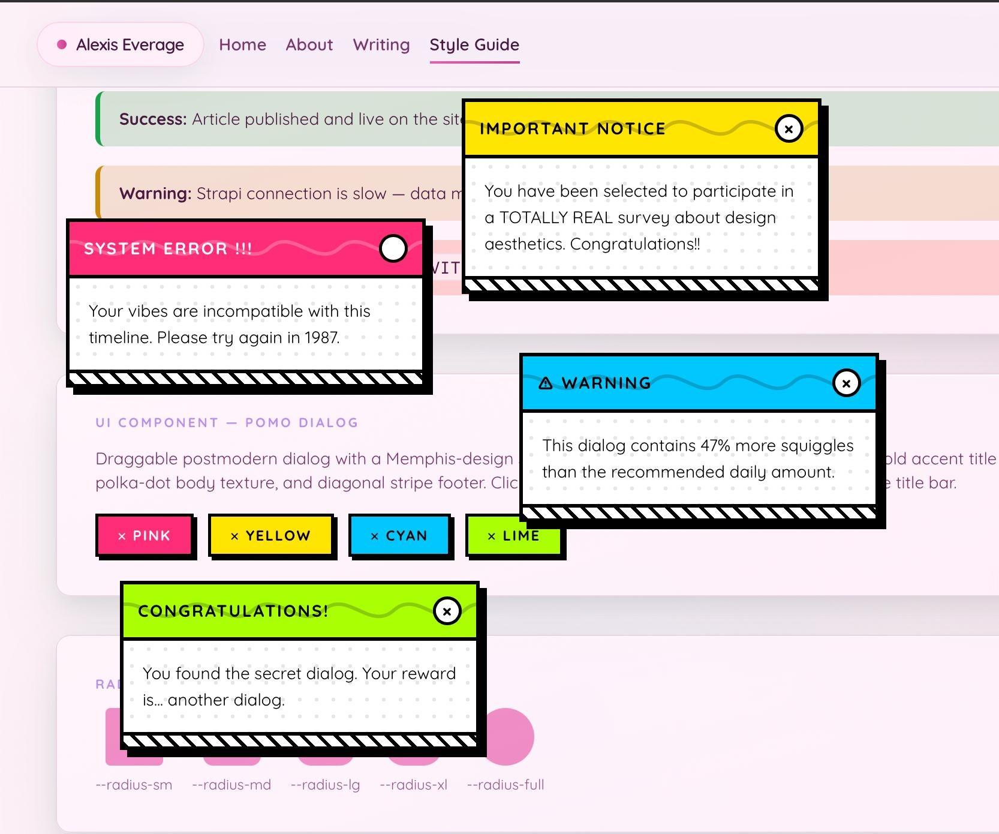
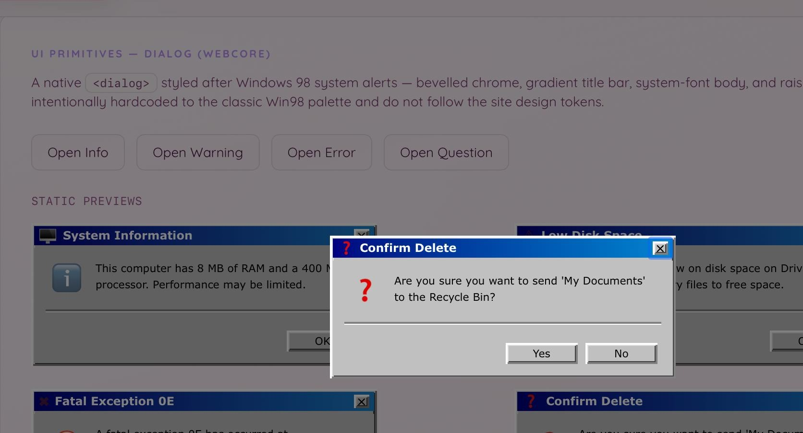
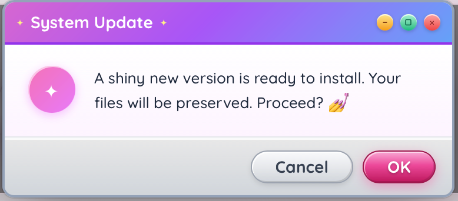

# Aesthetic Frontend Skills ✨

[](https://skills.sh)

A focused collection of AI agent skills for building aesthetically beautiful, creative web frontend UIs. Covers visual aesthetics end-to-end: from literacy and research through image analysis, asset generation, and token output.

**Scope boundary**: aesthetics only. Accessibility, performance, layout systems, and component architecture are explicitly out of scope.

### Wacky Postmodern
*"Design a dialog component with a wacky postmodern aesthetic..."*



### Webcore
*"Restyle this alert box using a webcore aesthetic..."*



### Y2K McBling (Hybrid)
*"Apply a Y2K McBling aesthetic to this modal component..."*



## Quick Install

**Fastest — no clone needed:**

```bash
# All 5 skills, project-level (default)
npx skills add alexiseverage/aesthetic-frontend-skills

# All 5 skills, user-level (available across all your projects)
npx skills add alexiseverage/aesthetic-frontend-skills -g

# Individual skill
npx skills add alexiseverage/aesthetic-frontend-skills@aesthetic-literacy
```

For project-level installs, also scaffold the knowledge directory:

```bash
mkdir -p knowledge/aesthetics
```

For global installs (`-g`), create the global knowledge dir once:

```bash
mkdir -p ~/.agents/skills/knowledge/aesthetics
```

Then reload VS Code: **Command Palette → Developer: Reload Window**.

Or use a [git submodule](#as-a-git-submodule) if you want to pull updates.

---

## Using in Your Project

### 1. Install the skills

**Option A — Copy into your project** (simplest):

```bash
git clone https://github.com/alexiseverage/aesthetic-frontend-skills /tmp/afs
cp -r /tmp/afs/skills ./skills
rm -rf /tmp/afs
```

> **`skills/` name conflict?** Copy into a subdirectory instead: `cp -r /tmp/afs/skills ./skills/aesthetics`

**Option B — Git submodule** (receive updates via `git submodule update`):

```bash
git submodule add https://github.com/alexiseverage/aesthetic-frontend-skills aesthetic-skills
```

Skills are referenced by name — the agent resolves the location automatically.

**Option C — User-scope install** (available across all your projects):

```bash
# Via npx skills (recommended)
npx skills add alexiseverage/aesthetic-frontend-skills -g

# Or copy manually
cp -r skills/* ~/.agents/skills/
```

Agents discover these automatically. For global installs, create the knowledge directory once:

```bash
mkdir -p ~/.agents/skills/knowledge/aesthetics
```

**Option D — Individual skill** (pick only what you need):

```bash
npx skills add alexiseverage/aesthetic-frontend-skills@aesthetic-literacy
npx skills add alexiseverage/aesthetic-frontend-skills@aesthetic-research
npx skills add alexiseverage/aesthetic-frontend-skills@image-analysis
npx skills add alexiseverage/aesthetic-frontend-skills@aesthetic-application
npx skills add alexiseverage/aesthetic-frontend-skills@asset-creation
```

### 2. Scaffold the knowledge directory

```bash
mkdir -p knowledge/aesthetics
```

Then add to your project's `.gitignore`:

```gitignore
knowledge/aesthetics/*/images/
knowledge/aesthetics/*/generated/
```

> **Windows (PowerShell):** `New-Item -ItemType Directory -Force knowledge\aesthetics`

The `knowledge/aesthetics/` directory is where research profiles are written as you use the skills. Skills resolve the path to the workspace root (project-level installs) or `~/.agents/skills/knowledge/aesthetics/` (global installs). Commit the `.md` profiles — they are the accumulated knowledge base. The `images/` and `generated/` subdirectories are local-only.

### 3. Register skills with your agent

Copy the snippet from [`copilot-instructions.template.md`](copilot-instructions.template.md) into your project's `.github/copilot-instructions.md`. The same block works for all install methods — project-scoped, git submodule, or user-scope — because skills are referenced by name, not by path.

For user-scope installs, VS Code Copilot discovers skills automatically — no registration entry is strictly required, but adding the block gives the agent activation keywords and knowledge path hints.

### 4. Configure tool-specific skills (optional)

The core skills in this repo are **tool-agnostic** — they instruct your agent on *what* to do, not *how* to do it with a specific API.

For specific tools, install companion skills alongside these:

| Tool | Companion skill repo | Adds |
|---|---|---|
| Pinterest + Playwright | [`pinterest-image-downloader`](https://github.com/alexiseverage/pinterest-image-downloader) | Automated image collection from Pinterest via Playwright MCP |
| Recraft V4 | [`recraft`](https://github.com/alexiseverage/recraft) | Recraft MCP / REST API workflows, model selection, style references |

Without any companion skills, `aesthetic-research` will use whatever browser and image tools your agent has access to, and `asset-creation` will gracefully degrade to providing ready-to-paste prompt specs for manual generation.

---

## Skills

| Skill | Layer | When to Use |
|---|---|---|
| [`aesthetic-literacy`](skills/aesthetic-literacy/SKILL.md) | foundation | Understand and characterize any named aesthetic across 7 formal dimensions |
| [`aesthetic-research`](skills/aesthetic-research/SKILL.md) | applied | Research unknown/niche aesthetics by collecting visual references from available image sources |
| [`image-analysis`](skills/image-analysis/SKILL.md) | applied | Extract implementable CSS values from collected reference images |
| [`asset-creation`](skills/asset-creation/SKILL.md) | applied (optional) | Generate images and SVG components using available image generation tools; convert SVGs to React components |
| [`aesthetic-application`](skills/aesthetic-application/SKILL.md) | applied | Translate a confirmed aesthetic into W3C design tokens, CSS custom properties, and component notes |

## Knowledge Base

Aesthetic profiles are stored in `knowledge/aesthetics/` at your project root (for project-level installs) or `~/.agents/skills/knowledge/aesthetics/` (for global installs). Each profile is:
- Produced by `aesthetic-research` and enriched by `image-analysis`
- **Append-only** — never overwritten; new runs append a dated section
- Committed to git (images are git-ignored as local-only)

See [skills/aesthetic-research/knowledge/README.md](skills/aesthetic-research/knowledge/README.md) for profile format and frontmatter conventions.

---

## End-to-End Walkthrough

**Goal**: Apply a vaporwave aesthetic to a web product.

```
1. Load the `aesthetic-literacy` skill
   → Confirm: "vaporwave" maps to Family 1 (Digital/Internet-Native)
   → Review: 7-dimension characterization + non-negotiables

2. (Optional) Research to validate empirically
   → Load the `aesthetic-research` skill
   → Collect visual references for "vaporwave UI" from available image sources
   → Profile written to: knowledge/aesthetics/vaporwave.md

3. (Optional) Analyze collected images
   → Load the `image-analysis` skill
   → Extract implementable values (hex colors, px ranges, CSS techniques)
   → Appends ## Analysis section to knowledge/aesthetics/vaporwave.md

4. (Optional) Generate reference assets
   → Load the `asset-creation` skill
   → Generate background texture and UI icon SVGs using available image generation tools

5. Translate aesthetic to tokens
   → Load the `aesthetic-application` skill
   → Output: W3C DTCG JSON tokens + CSS custom properties + component notes
```


